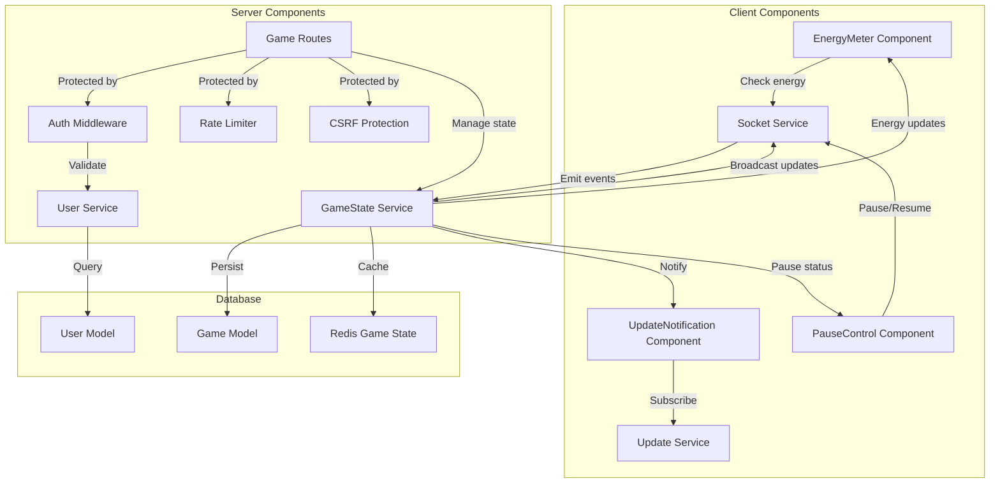

```mermaid
graph TD
    %% Client-Side Components
    subgraph "Client Components"
        EnergyMeter["EnergyMeter Component"]
        PauseControl["PauseControl Component"]
        UpdateNotification["UpdateNotification Component"]
        socketService["Socket Service"]
        updateService["Update Service"]
    end

    %% Server-Side Components
    subgraph "Server Components"
        GameStateService["GameState Service"]
        UserService["User Service"]
        AuthMiddleware["Auth Middleware"]
        RateLimit["Rate Limiter"]
        CSRFProtection["CSRF Protection"]
        GameRoutes["Game Routes"]
    end

    %% Database
    subgraph "Database"
        GameModel["Game Model"]
        UserModel["User Model"]
        Redis["Redis Game State"]
    end

    %% WebSocket Communication
    socketService -->|"Emit events"| GameStateService
    GameStateService -->|"Broadcast updates"| socketService
    
    %% Component Data Flow
    EnergyMeter -->|"Check energy"| socketService
    PauseControl -->|"Pause/Resume"| socketService
    UpdateNotification -->|"Subscribe"| updateService
    
    %% Server Authentication Flow
    AuthMiddleware -->|"Validate"| UserService
    UserService -->|"Query"| UserModel
    
    %% Game State Flow
    GameRoutes -->|"Protected by"| AuthMiddleware
    GameRoutes -->|"Protected by"| RateLimit
    GameRoutes -->|"Protected by"| CSRFProtection
    GameRoutes -->|"Manage state"| GameStateService
    GameStateService -->|"Persist"| GameModel
    GameStateService -->|"Cache"| Redis

    %% Real-time Updates
    GameStateService -->|"Notify"| UpdateNotification
    GameStateService -->|"Energy updates"| EnergyMeter
    GameStateService -->|"Pause status"| PauseControl
```