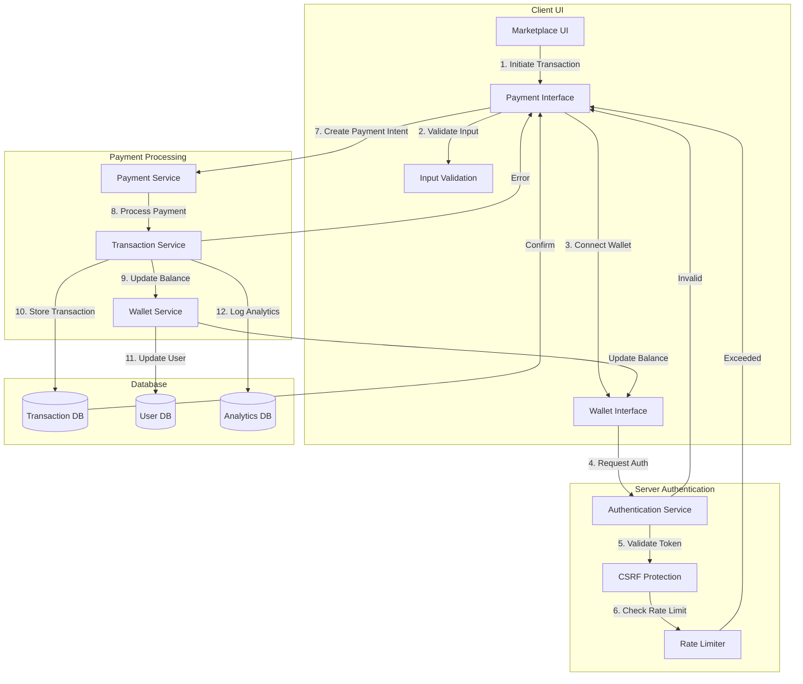

```mermaid
graph TD
    %% Client-Side Components
    subgraph "Client UI"
        UI[Marketplace UI]
        WalletUI[Wallet Interface]
        PaymentUI[Payment Interface]
        ValidationUI[Input Validation]
    end

    %% Server-Side Components
    subgraph "Server Authentication"
        Auth[Authentication Service]
        CSRF[CSRF Protection]
        RateLimit[Rate Limiter]
    end

    subgraph "Payment Processing"
        PaymentService[Payment Service]
        TransactionService[Transaction Service]
        WalletService[Wallet Service]
    end

    subgraph "Database"
        TransactionDB[(Transaction DB)]
        UserDB[(User DB)]
        AnalyticsDB[(Analytics DB)]
    end

    %% Core Flow
    UI -->|1. Initiate Transaction| PaymentUI
    PaymentUI -->|2. Validate Input| ValidationUI
    PaymentUI -->|3. Connect Wallet| WalletUI
    
    WalletUI -->|4. Request Auth| Auth
    Auth -->|5. Validate Token| CSRF
    CSRF -->|6. Check Rate Limit| RateLimit

    PaymentUI -->|7. Create Payment Intent| PaymentService
    PaymentService -->|8. Process Payment| TransactionService
    TransactionService -->|9. Update Balance| WalletService

    TransactionService -->|10. Store Transaction| TransactionDB
    WalletService -->|11. Update User| UserDB
    TransactionService -->|12. Log Analytics| AnalyticsDB

    %% Error Handling
    TransactionService -->|Error| PaymentUI
    Auth -->|Invalid| PaymentUI
    RateLimit -->|Exceeded| PaymentUI

    %% Success Flow
    TransactionDB -->|Confirm| PaymentUI
    WalletService -->|Update Balance| WalletUI
```